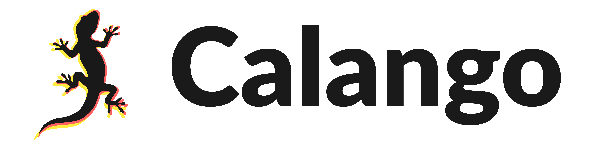

<picture>
  <source media="(prefers-color-scheme: dark)" srcset="assets/calango/logo_dark.png">
  
</picture>

**Calango** is a modern, high-performance, cross-platform desktop application for materials science, crystallography, and atomistic modeling. By combining a raw C++20/OpenGL core with the flexibility of Python's Atomic Simulation Environment (ASE), Calango provides the speed needed for real-time 3D visualization together with the extensibility of state-of-the-art simulation tools.

[](LICENSE)
[](https://isocpp.org/)
[](https://cmake.org/)
[](https://www.qt.io/)
[](https://www.python.org/)

---

## Key Features

### 3D Visualization and Aesthetics
- **High-Performance Viewport:** Fully accelerated `QOpenGLWidget` canvas leveraging OpenGL 3.3 core-profile instanced rendering to fluidly display thousands of atoms (spheres) and bonds (cylinders) in a single draw call per mesh type.
- **Representation Modes:** Ball-and-stick, space-filling (CPK), and wireframe, with multiple-bond perception (double/triple bonds rendered as parallel cylinders).
- **Gradient Bond Coloring:** Each bond blends smoothly from one atom's color to the other's (Gouraud-interpolated along the cylinder axis in the instanced shader), toggleable back to the classic half-and-half split.
- **Modular Dock Panels:** Viewport settings live in three independent dock widgets — Representation, Unit Cell and Axes (including an axes-triad size control), and Lighting — which can be docked side-by-side, stacked as tabs, or floated; the layout persists across sessions.
- **8-Zone Grid Workspace:** The default layout is a 4x2 grid — Structure, the spanning 3D viewport, and Representation across the top row; Lighting, the spanning Job console, and Unit Cell and Axes across the bottom — with every zone resizable via splitters.
- **Dynamic Atom Color Mapping:** Four coloring modes selectable from the Display panel, applied to atoms and their bond halves in every representation:
  - *Element (CPK):* the Jmol palette with per-element user overrides.
  - *Coordination Number (CN):* discrete CN values mapped along a continuous gradient.
  - *Generalized Coordination Number (GCN):* continuous GCN values, ideal for highlighting terraces, steps, edges, and vertices of nanoparticles and slabs.
  - *Custom Property:* any per-atom scalar field carried by the structure (charges, force magnitudes, extended-XYZ columns) overlaid on the atomic spheres.
- **Scientific Gradients:** Viridis, Plasma, and Turbo colormaps with a live legend-range readout; trajectory playback re-colors every frame, so CN/GCN maps stay in sync during animations.
- **Force and Velocity Arrows:** Per-atom force and velocity vectors render as lit 3D arrows (cylinder shaft plus cone head) from each atom center, with a scale slider/spinbox in the Representation panel; data imports automatically from extended-XYZ force columns and trajectory momenta.
- **Lighting and Camera Control:** Turntable camera with double-click reframing, perspective/orthographic projections preserving apparent scale, and a multi-light studio setup (warm key plus cool fill) editable in a real-time lighting panel (up to four directional lights, Blinn-Phong).
- **Per-Element Styling:** CPK color overrides via `QColorDialog` and per-element radius scaling, plus global atom-radius and bond-width sliders with synced spin boxes.
- **Viewport Furniture:** Axes triad showing Cartesian (X, Y, Z) or Bravais lattice vectors (a1, a2, a3), and unit cell boundaries rendered as thin lines or lit tubes with configurable color and width.

### Structure Building and File I/O
- **Broad File Format Support:** Read and write any format supported by ASE, including `.cif`, `POSCAR`/`CONTCAR`, `.xyz`/`.extxyz`, Quantum ESPRESSO input/output, CASTEP `.cell`, LAMMPS data and dump files, Gaussian `.gjf`/`.com`, and SHELX `.res`. Per-atom arrays in extended-XYZ files (charges, forces) are imported as color-mappable scalar fields.
- **Crystal and Nanomaterial Wizard:** Generate supercells, cleave slabs along Miller indices, or build graphene sheets, nanoribbons, carbon nanotubes, and MX2 TMD monolayers.
- **Editing Tools:** Add/delete atoms, change chemical species, translate selections, all with snapshot undo/redo; ray-cast picking with click and Ctrl/Cmd+click multi-selection.
- **Periodic Table Selector:** Adding an atom or changing a selection's element opens a graphical periodic table (Z = 1 to 118, colored by chemical family) for single-click selection.
- **Interactive Bond Editor:** Toggle automatic bond perception, tune the covalent cutoff multiplier live, and manually add or suppress individual bonds between atom pairs (by index or from the two-atom viewport selection); overrides live on the structure and are undoable.
- **Three-Stage Surface Slab Wizard:** (1) pick the orientation with Miller spinboxes or by dragging the in-plane cell vectors on a lattice canvas — snapped vectors recompute the nearest integer (h k l) exactly; (2) choose top/bottom termination layers and thickness on an orthogonal cross-section view; (3) configure top/bottom or centered vacuum with a full 3D preview before insertion.
- **Trajectory Export:** Save multi-frame datasets as extended XYZ, multi-frame XYZ, ASE .traj, or multi-model PDB.
- **Databases and Examples:** Curated benchmark presets (diamond, MoS2 phases, graphene, aromatic molecules) plus Materials Project fetch-by-id through the documented REST API.
- **Deformation and Randomization:** Gaussian or uniform noise on positions and/or cell vectors (affine strain), single-shot or as multi-frame stochastic trajectories.
- **Tabbed Workspace and Timeline:** Every structure or trajectory opens in its own tab with per-document undo history; a playback timeline (0.1 to 120 fps) scrubs MD runs, optimization paths, and generated displacement sets.

### Simulation and Machine-Learning Potentials
- **Calculators Supported:** Empirical potentials (EMT, Lennard-Jones), machine-learning interatomic potentials (MACE-MP-0 and MACE-OFF foundation models or custom `.model`/`.pt` checkpoints on CPU, CUDA, or MPS), and DFT script templates for Quantum ESPRESSO, VASP, GPAW, and SIESTA.
- **Tasks:** Single-point energies/forces, BFGS geometry optimization, and molecular dynamics across the full ASE ensemble matrix — NVE (velocity Verlet), NVT (Langevin, Andersen, Berendsen, Nose-Hoover chains), and NPT (Berendsen, Nose-Hoover/Parrinello-Rahman) — with thermostat/barostat coupling and pressure controls.
- **Live MD Monitoring:** The Job panel tracks the log, energy convergence, and ionic temperature vs. step, with a dashed thermostat-setpoint reference line for constant-temperature ensembles.
- **Interactive Script Editor:** Every GUI configuration is synthesized into a standalone, syntax-highlighted Python/ASE script that remains fully editable — manual edits pause form synchronization until an explicit regenerate. Scripts run unmodified on clusters.
- **Subprocess Isolation:** Jobs run as separate processes in per-job directories with live log capture, progress markers, an energy-convergence plot, and automatic trajectory loading on completion. A conda-environment selector routes jobs to any interpreter.

### Vibrational Analysis: Phonon Builder
- **Finite Displacements (Build menu):** Constructs the fully expanded supercell first and then applies plus/minus displacements (default 0.01 angstrom) along x, y, and z to every atom it contains — 6N_supercell + 1 configurations, following the standard finite-displacement recipe (Phonopy-style; symmetry reduction is on the roadmap).
- **Two Workflows:**
  - *Generate displaced structures:* the displacement set opens as a trajectory tab, ready for inspection or export to external DFT codes.
  - *Run calculation:* a generated ASE script computes forces with EMT, Lennard-Jones, or MACE, assembles force constants and the dynamical matrix (acoustic sum rule enforced), and reports vibrational frequencies.
- **Outputs:** Gamma-point mode frequencies in the job console, phonon dispersion along the ASE-suggested Brillouin-zone path (`phonon_bands.csv`), and phonon density of states (`phonon_dos.csv`). Isolated molecules run through `ase.vibrations` instead, producing a frequency summary and per-mode animation trajectories that Calango opens directly.

### Analysis and Reciprocal Space
- **Coordination Analysis (CN/GCN):** Per-atom coordination numbers from covalent-radius scaling or a fixed cutoff, with exact periodic-image enumeration (correct even for primitive cells), and generalized coordination numbers following Calle-Vallejo and co-workers with a configurable bulk reference (12 fcc, 8 bcc, 4 diamond, or auto). Results appear in a sortable table with summary statistics and can be pushed onto the viewport colors in one click.
- **Radial Distribution Function g(r):** Total and element-pair partial RDFs with exact periodic-image evaluation (valid beyond L/2, triclinic-safe), computed on a worker thread, plotted interactively, and exportable as `.csv` or `.dat` data files — including frame-averaged RDFs over a selectable trajectory range (start, end, stride).
- **Bond Length and Angle Distributions:** Histogram statistics of pair distances and three-body angles within a configurable cutoff, with species filters, periodic-image handling, and CSV export.
- **Static Structure Factor S(q):** Computed from the (frame-averaged) pair distribution via a Lorch-windowed Fourier transform, with configurable q range and CSV export.
- **XRD Simulation:** Debye-equation powder diffraction patterns (via ASE) with Cu/Co/Mo/Cr K-alpha or custom wavelengths, supercell sharpening for crystals, and export of both the 2-theta intensity curve and the detected peak list with d-spacings.
- **Crystallographic Info:** The Structure panel reports a, b, c, alpha, beta, gamma, volume, periodicity, and the spglib-detected space group, point group, and crystal system.
- **Brillouin Zone Viewer:** Wigner-Seitz cells of the reciprocal lattice with high-symmetry labels (Gamma, X, W, K, L, U, ...) from ASE's Bravais-lattice detection, with directional arrows drawn along the k-path and high-resolution PNG/SVG figure export.
- **k-Path Builder:** Click-to-build k-paths with discontinuous sections (Gamma to X | M to R); a single "Export k-Path" action offers VASP `KPOINTS` (line mode), Quantum ESPRESSO `K_POINTS crystal_b`, CASTEP `SPECTRAL_KPOINT_PATH`, SIESTA `BandLines`, and standalone ASE/Python scripts.

### Publication Output
- **Static Images:** High-resolution off-screen capture (8x MSAA, up to 8192 px) as PNG (transparent or solid) or JPEG, with 720p/1080p/4K resolution presets.
- **Animations:** Turntable or trajectory export to animated GIF (with transparency) or MP4 (H.264) up to 4K, with resolution presets, framerate, and background options.
- **Ray Tracing:** POV-Ray and Tachyon scene export reproducing the active viewport (camera, lights, styling, multi-bonds, cell), with in-app renderer invocation and log capture.

---

## Technology Stack

| Layer | Technology |
| --- | --- |
| Language | C++20 (GCC 11+, Clang 13+, MSVC 2022+) |
| GUI toolkit | Qt 6.4+ (Widgets, OpenGLWidgets, Concurrent) |
| Rendering | OpenGL 3.3 core profile, GLSL 330, instanced draw calls |
| Embedded scripting | CPython 3.9+ via pybind11 (2.12+, fetched automatically if absent) |
| Atomistic engine | ASE (Atomic Simulation Environment) |
| ML potentials | MACE (mace-torch), optional |
| Build system | CMake 3.21+ |

## Architecture Philosophy

Calango enforces a strict Model-View-Controller (MVC) split to ensure stability, performance, and easy extension:

```
            +----------------------------------------------+
            |                  gui/  (Qt Widgets)          |
            |   MainWindow = Controller                    |
            |   ViewportWidget / docks / dialogs = Views   |
            +------+----------------+-------------+--------+
                   | observes       | uses        | uses
            +------v------+  +------v-------+  +--v-----------+
            |   render/   |  |python_bridge/|  |    jobs/     |
            | OpenGL View |  | embedded ASE |  |   QProcess   |
            +------+------+  +------+-------+  +--------------+
                   | reads          | converts
            +------v----------------v-------+
            |            core/              |
            |  Model: Structure, Atom,      |
            |  UnitCell, Coordination, Rdf, |
            |  CalculatorConfig, script     |
            |  generators (ASE, phonons)    |
            +-------------------------------+
```

1. **`core/` (Model):** Physics and geometry — structures, cells, bond perception, coordination and RDF analysis, and the ASE/phonon script generators. Pure C++ with zero GUI or Python dependencies.
2. **`python_bridge/` (Stateless Translator):** Converts between `core::Structure` and `ase.Atoms` via pybind11, including per-atom scalar arrays. Python types never escape this boundary.
3. **`render/` (OpenGL View):** Builds instanced GPU buffers from model data, including the scalar-to-gradient color mapping (Viridis/Plasma/Turbo). Never mutates state.
4. **`jobs/` (Subprocess Engine):** Spawns simulations with `QProcess` and parses stdout markers (`CALANGO_PROGRESS`, `CALANGO_ENERGY`, `CALANGO_RESULT`) for real-time GUI updates.
5. **`gui/` (Controller and Widgets):** Dispatches user actions and coordinates the views.

---

## Compilation and Setup

### Prerequisites
- A C++20 compliant compiler (GCC 11+, Clang 13+, MSVC 2022+).
- **CMake** 3.21 or newer.
- **Qt 6.4+** with the `Widgets`, `OpenGLWidgets`, and `Concurrent` modules.
- **Python 3.9+** with development headers (tested up to 3.14).

### Step-by-Step Build Guide

1. **Set up the embedded Python environment:**
   ```bash
   # Create a virtual environment in the project root
   python3 -m venv .venv

   # Install the scientific and export packages
   .venv/bin/pip install ase numpy spglib pillow imageio imageio-ffmpeg

   # (Optional) Install MACE for machine-learning potentials
   .venv/bin/pip install mace-torch
   ```

2. **Configure with CMake:**
   ```bash
   cmake -S . -B build -DCMAKE_BUILD_TYPE=Release \
         -DPython3_EXECUTABLE=$PWD/.venv/bin/python \
         -DCMAKE_PREFIX_PATH=/path/to/Qt/6.x/<platform>
   ```
   On macOS with Homebrew Qt, `-DCMAKE_PREFIX_PATH=/opt/homebrew/opt/qt`.

3. **Build and run:**
   ```bash
   cmake --build build -j

   # Run with a sample structure
   ./build/calango assets/examples/diamond.vasp
   ```

---

## Python Environment Resolution

Embedded Python runtimes do not automatically inherit shell virtual environments, so Calango resolves its interpreter in this priority order:

1. **`CALANGO_PYTHON`** environment variable — explicit path to a Python executable (highest priority).
2. **`VIRTUAL_ENV`** environment variable — a currently activated virtual environment.
3. **Configure-time interpreter** — the one CMake found when the build was configured.

Simulation jobs are independent of the embedded interpreter: the calculator and phonon dialogs include an execution-environment selector (conda environment folder or interpreter path) that is persisted across sessions.

### Environment File (.env)

At launch Calango reads an environment file — `~/.env` by default, overridable in Edit, Preferences — and exports `MP_API_KEY` (the Materials Project API key) into the process environment. A key already present in the shell environment takes precedence at startup; the Preferences dialog can reload the file unconditionally.

### Diagnostics
```bash
# Print the resolved interpreter, Python version, and ASE availability
./build/calango --probe-python

# Force a specific interpreter
export CALANGO_PYTHON=/path/to/.venv/bin/python
./build/calango
```

---

## Repository Layout

- `CMakeLists.txt` — global build configuration.
- `assets/`
  - `shaders/` — GLSL shaders (compiled in as Qt resources).
  - `examples/` — benchmark structure files for the Examples browser.
  - `calango/` — brand assets (application icon, logos; icon variants are embedded as Qt resources).
- `docs/` — architecture guides and design notes.
- `src/`
  - `main.cpp` — application entry point and CLI (`--probe-python`).
  - `core/` — data model, geometry, coordination/RDF analysis, script generators.
  - `python_bridge/` — embedded interpreter control and ASE interop.
  - `render/` — instanced OpenGL renderer, colormaps, ray-trace exporter.
  - `jobs/` — subprocess job runner and progress parsing.
  - `gui/` — main window, viewport, docks, and dialogs.

## License

Calango is released under the MIT License. See `LICENSE` for details.
