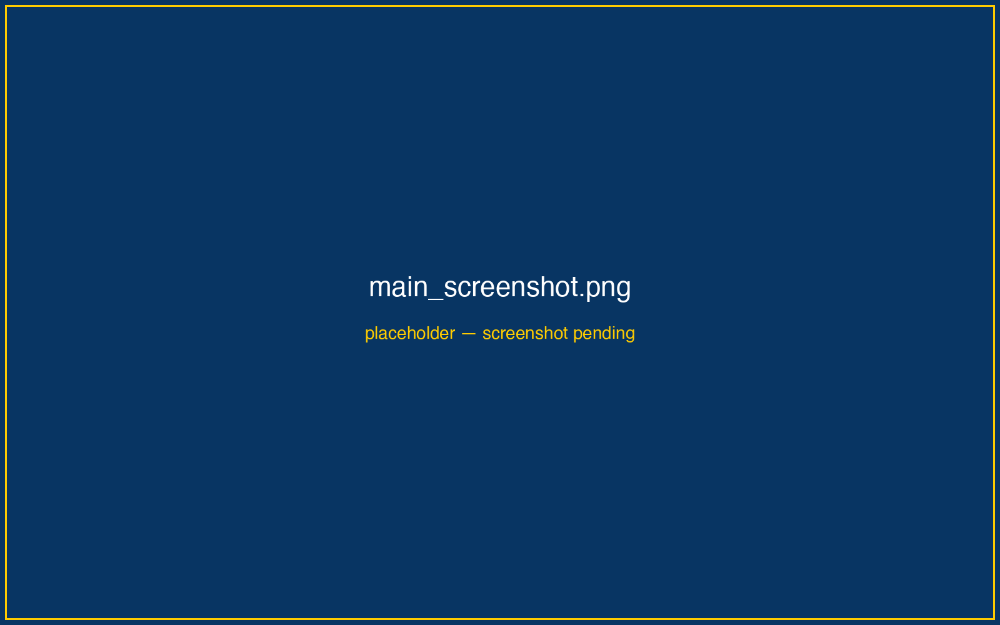

.. raw:: html

   

     <!-- LOGO -->
     

     <!-- BADGES -->
     

       
       
       
       
       
     

   

**Calango** is a desktop application for computational materials science built on two pillars: a **simulation engine** that configures, executes, orchestrates, and analyzes atomistic calculations across nineteen backends — from empirical potentials to DFT, GW, and machine-learning force fields — and a **3D visualization studio** that renders, edits, and publishes atomic structures in real time on an instanced OpenGL canvas. A C++20 core provides the speed; an embedded Python interpreter running the Atomic Simulation Environment (ASE) provides the science.

   The Calango workspace: dockable panels around a hardware-accelerated 3D viewport.

.. toctree::
   :maxdepth: 2
   :hidden:

   Home <self>
   GitHub <https://github.com/seixas-research/calango>

.. toctree::
   :maxdepth: 2
   :hidden:
   :caption: Getting Started

   installation
   quickstart
   python_environment

.. toctree::
   :maxdepth: 2
   :hidden:
   :caption: Tutorials

   tutorials/index

.. toctree::
   :maxdepth: 2
   :hidden:
   :caption: Modeling & Visualization

   workspace
   viewport
   representation
   data_io
   editing
   builders/index
   output

.. toctree::
   :maxdepth: 2
   :hidden:
   :caption: Simulation

   simulations/index

.. toctree::
   :maxdepth: 2
   :hidden:
   :caption: Electronic Structure

   electronic/index

.. toctree::
   :maxdepth: 2
   :hidden:
   :caption: Analysis

   analysis/index

.. toctree::
   :maxdepth: 2
   :hidden:
   :caption: Reference

   reference/index
   gallery

----

Architecture & Philosophy
=========================

Calango enforces a strict separation between what you see and what computes. The GUI is a Qt 6 shell around a Qt-free C++ core; everything scientific that leaves the program does so as a **standalone, human-readable Python/ASE script**.

**Data pipeline:**
  Structure on screen (``core::Structure``, pure C++)
    ↳ Wizard configuration (calculator, task, execution environment)
      ↳ Generated ASE script — editable, self-contained, cluster-ready
        ↳ Isolated subprocess (local queue) or SSH submission (SLURM / PBS / SGE)
          ↳ Live progress markers → energy / temperature / force / pressure plots
            ↳ Result artifacts (JSON, CSV, trajectories, cube files)
              ↳ Dedicated viewers — bands, spectra, phonons, GW, Wannier, volumetric

Three design rules follow from this pipeline:

1. **Scripts are the contract.** Every calculation Calango runs can be exported and executed unmodified on any machine with ASE — the GUI is a script generator with a run button, not a black box.
2. **Nothing scientific runs in-process.** Simulations execute as separate processes in per-job directories; a crashed DFT run, a wedged SSH connection, or an out-of-memory MD never takes the application down.
3. **Baselines are inherited, not recomputed.** Response-property workflows (optics, GW, Wannier functions) load a completed, inspected ground state instead of silently converging their own — every spectrum is attributable to a specific SCF solution.

----

Feature areas
=============

.. list-table::
   :header-rows: 1
   :widths: 22 58 20

   * - Area
     - What it covers
     - Where
   * - Building
     - Slabs, interfaces, dislocations, polycrystals, nanomaterials, nanoparticles, SQS, polymers, ice, adsorbates
     - :doc:`builders/index`
   * - Simulation
     - Nineteen calculators; optimization, MD, phonons, Monte Carlo, NEB, cluster expansion, convergence sweeps, MLIP training
     - :doc:`simulations/index`
   * - Electronic structure
     - Bands with irreps and fatbands, unfolding, optics (linear, 2D, nonlinear), GW, Wannier, XAS, Hubbard U, Raman/IR, defects
     - :doc:`electronic/index`
   * - Analysis
     - RDF, S(q), XRD, coordination, short-range order, entropy, magnetic space groups, volumetric fields, Brillouin zones
     - :doc:`analysis/index`
   * - Execution
     - Local job queue, live monitoring, the Orchestration canvas, remote HPC over SSH
     - :doc:`simulations/jobs`
   * - Publishing
     - High-resolution stills, animations, POV-Ray/Tachyon ray tracing, Alembic export
     - :doc:`output`
